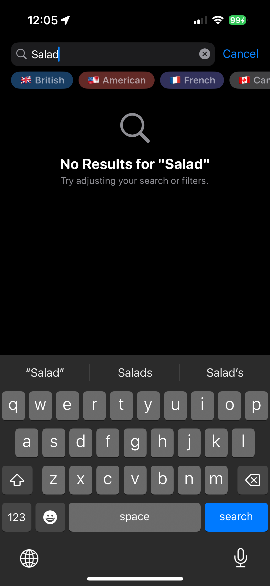

# Dishcovery

**Dishcovery (noun) [dish-kuh-vuh-ree]**

1. The act of discovering a new dish, recipe, or culinary technique, often by accident or curiosity.\
_"Last night’s fridge raid led to an unexpected dishcovery—a peanut butter and sriracha grilled cheese."_
2. A moment of revelation when one finds the perfect meal for their current craving or dietary need.\
_"After weeks of searching, my dishcovery of the ultimate gluten-free lasagna changed my life."_
3. The process of exploring and cataloging unique or obscure dishes from around the world.\
_"His food blog is dedicated to dishcovery, highlighting hidden gems from street markets to Michelin-starred kitchens."_

_Related: dishcover (verb) – to uncover or create a new dish._\
_Etymology: A playful blend of dish and discovery, coined by Brad Cooley during his Take Home assessment for the iOS Engineer Role at Fetch._

## Development Environment Setup

### Prerequisites

- [Xcode 16+](https://apps.apple.com/us/app/xcode/id497799835?mt=12/)

### Summary

My app, Dishcovery, was designed entirely by myself with my focus making it feel very native to the Apple ecosystem. I've included a demo video, and screenshots below. 

> [!TIP]
> If you are going to run it yourself, I recommend running on a physical device to experience haptics!

#### Demo Video

Because the demo video was too big to upload to Github, you can check it out [here](https://youtube.com/shorts/9Sp_FZFilq4?feature=share).

#### Screenshots

##### Core Functionality (as defined in project spec)

| Main Screen | Pull to Refresh | Malformed Data | Empty Data |
| :---: | :---: | :---: | :---: |
|  |  |  |  |

##### Extra Functionality (personal choices / design of app)

| Bottom Sheet / Expanded View | Searching with Filters | Cuisine Filters Only |
| :---: | :---: | :---: |
|  |  |  |

| No Search Results | Long Press | App Icon |
| :---: | :---: | :---: |
|  |  |  |

### Focus Areas

For this app, I wanted to highlight my ability to design elegant and simple user experiences while prioritizing the feature's technical implementation. I'll dive into the couple of central focuses I had while developing Dishcovery.

#### MVP: Quick Time to Value

On my first pass of the application, I was able to do it in roughly an hour. It accomplished three out of the five requirements:

- ✅ Swift Concurrency
- ✅ No External Dependencies
- ❌ Efficient Network Usage
- ❌ Testing
- ✅ SwiftUI

However, I thought that _Efficient Network Usage_ was accomplished using `AsyncImage`. It wasn't until I dug deeper into understanding it that I realized it **doesn't do any caching of images**. So, that had to be fixed in my next version. Regardless of whether I'm doing an MVP or a full feature, I always try to set up my architecture in the first place to be scalable based on what I'm expecting the application to do and become in the future. With this one being (mostly) fixed scope, I decided to start off with a strictly MVVM architecture pattern.

#### V2: Reaching Requirements

The second pass of the application led me to realize, as alluded to above, that `AsyncImage` wasn't going to work for this. So, the first thing I worked to build was some image caching. I focused here because I wanted to make sure as fetched data grew, the application was still performant; a laggy application is one of the biggest contributors to a poor user experience. I took the approach that I wanted to load the small image first and only fetch the larger image when it was absolutely needed. In the first implementation of my UI, there was no place where the large image was used. As I built out the UI, I would eventually use the larger image. Once the larger image was cached, I purged the smaller one from the cache to ensure the device storage didn't get flooded. I'm unsure if I 100% love this approach, and I'll explain why below in the [trade-offs section](#trade-offs-and-decisions).

I then wrote some basic tests for my API and the image caching, which showed me I needed to move my architecture to a hybrid MVVM + Services/Repositories approach.

#### V2: UI/UX Considerations

After getting image caching working, it was time to build out the app experience further because I wanted to showcase my skills with SwiftUI more than the basic UI I had built in the first version (as seen [here](https://github.com/bcooleyfetch/Dishcovery/pull/2#issue-2825525423)). I chose to try and make the app feel very native to the Apple ecosystem and tried to follow their design language and HIGs (human interface guidelines) as best as I could (as a non-trained designer).

The first thing I redesigned was the recipe feed. I wanted a card-styled view over a list view so I could display more than just one recipe per row. I also knew I could use a `LazyVGrid` to efficiently render (and fetch, in our case) the recipe cards. I tried to challenge myself to display as much information about the recipe as possible (without overwhelming the user) on the main screen. That's how I came up with the bubbles indicating cuisine and whether the card had any associated links.

From here, I immediately knew that I wanted the cards to be tappable and for it to open an "expanded" view of the recipe. This was a great way for me to display any links associated with the recipe and also meant we could easily scale the level of information about recipes in the future should the API ever change and give us back more information. Scalability should not only be for the technical side of apps but also prioritized when designing the UI.

The rest of my UI considerations (long press, haptics, filtering) all came about from how I like to interact with apps. Searching and filtering were the following things I tackled because as data grows, a user will not want to spend much time trying to find a specific piece of information; searching satisfies the need for specific information retrieval. Filtering leans into the "explore" philosophy of an app like this. Don't know what recipe to make? Why not start by pairing it down to something broad like cuisine?

#### V2: Architecture and Testing

Throughout the development of V2, I saw my MVVM architecture moving more and more towards an MVMVM (model-view-massive-view-model) architecture. I knew I needed to take a different approach by introducing a services layer that dealt with fetching from the API and the cache. With this came the need for protocols so I could mock out those services within my unit testing. It also allows for my view models not to have to know (or have access to) the specific implementation of the service; the central premise here is creating a clear separation of concerns.

Testing was relatively simple, and I tested for the happy path and a few edge cases. I accomplished this fairly well, including coverage for the application's core parts (caching, API, image loading).

#### V2: Final Checklist

With all that I described above, that brought the final checklist of requirements to:
- ✅ Swift Concurrency
- ✅ No External Dependencies
- ✅ Efficient Network Usage
- ✅ Testing
- ✅ SwiftUI

### Time Spent

#### February 1, 2025 (1hr 4mins)

MVP: Started at 6:30 PM EST and finished first pass of UI and API logic at 7:34 PM EST. Using `AsyncImage` for my image caching, but when testing on device and throttling the network, it performs poorly with caching. Will probably build my own caching service or something in the next iteration. Also no unit tests are written. This is primarily because I want to add in error handling, and rework the UI, so I plan to write tests after that.

#### February 2, 2025 (4hrs 34mins)

V2: Started working on the second implementation at 11:40 AM EST. I took breaks from 12:52 PM EST to 4:07 PM EST and then ended for the night at 7:29 PM EST. I pushed my code up to the repo on a new branch before heading to bed.

#### February 3, 2025 (1hr 44mins)

V2: Continued working on the second implementation at 6:32 AM EST and ended at 7:04AM EST. I went to work and then worked over lunch on finishing comments and the README from 11:51 AM EST until 1:03 PM EST.

**Total time spent: 7hrs 20mins**

#### Rough Project Splits

- Services, Logic, Models, Architecture: 2hrs
- UI/UX: 3hrs 15mins
- Testing: 50mins
- Commenting, Demo, README: 1hr 15mins

### Trade-offs and Decisions

I really wanted to implement full offline storage using CoreData (I'm not a believer in SwiftData _just yet_). However, I felt like the time dealing with model setup, model passing, random fetching issues, and all the extra effort dealing with Combine made it not worth it. The data (as it exists right now) is light enough to fetch every time we need it. This doesn't include images obviously, as we are caching that data, so that means in the worst case we are having to fetch five different strings (`uuid`, `name`, `cuisine`, `source_url`, and `youtube_url`). I also realize that I could've spent more time on making my caching a little more robust and fault tolerant, but I knew I wanted to spend time building out the UI to showcase the skills I have there. I wouldn't say this is a trade-off in my mind, but some might consider it that way; I think a good UI/UX makes a large difference with first impressions.

Diving specifically into my decision to purge the smaller images from the cache after we get the large one. I'm not 100% sure I love this solutuion, but I think it's a good middle groud for the current size of the application. Keeping the smaller image in the cache _with_ the larger image means we'll take up more disk space, which is why I chose to purge it. However, I can see an argument that can be made for **never** caching the larger image (because we don't need to get it that often/shouldn't use it that often) and just fetching it when we need it. This would mean the smaller image remains cached and (most likely) consumes less disk space than storing the larger image. I made the choice I did because I **did** want the larger image to be used wherever it could be. I believe it enhances the look of the UI and provides a crisper final product.

### Weakest Part of the Project: What do you think is the weakest part of your project?

The weakest part of my project is probably my testing and overall handling of edge cases. I wish I had spent more time on my testing, but felt that I had manually done usability testing and that would suffice for the testing of the ViewModel logic. The main area where my UI doesn't shine is handling slow network situations. I don't think this is a massive issue given I do have some error handling and some error states, but it could certainly be better.

### Additional Information

I really tried to follow the HIGs as best as I could. One example that I have is using a context menu (long press) on the recipe cards. HIGs say,
> Always make context menu items available in the main interface, too. For example, in Mail in iOS and iPadOS, the context menu items that are available for a message in the Inbox are also available in the toolbar of the message view. In macOS, an app’s menu bar menus list all the app’s commands, including those in various context menus.

I initially wanted to just have the context menu as a way to see the links associated with a recipe. After reading up on context menus (this is my first time using/implementing them), I realized I needed some sort of view or way for the links to be accessible, which is how the bottom sheet came to be.
